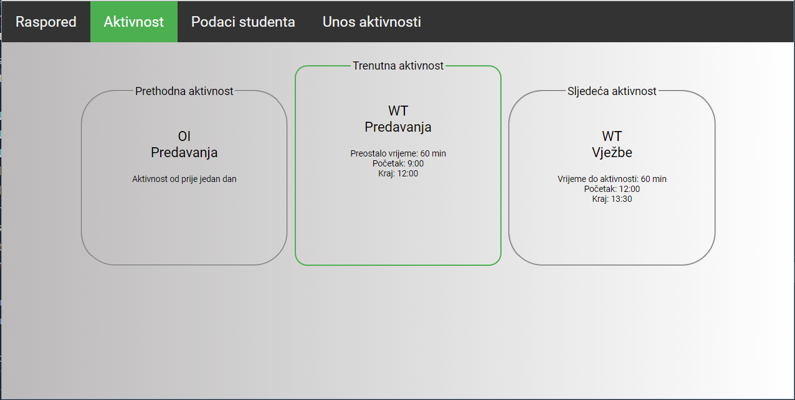
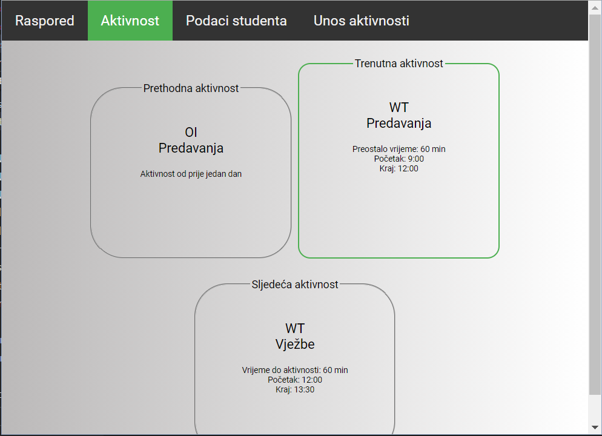
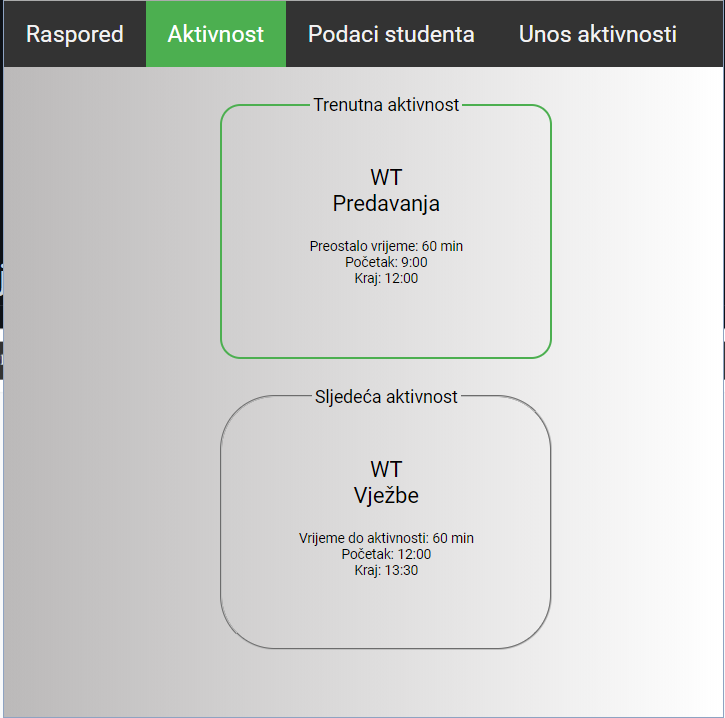
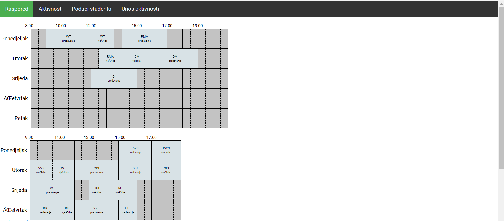
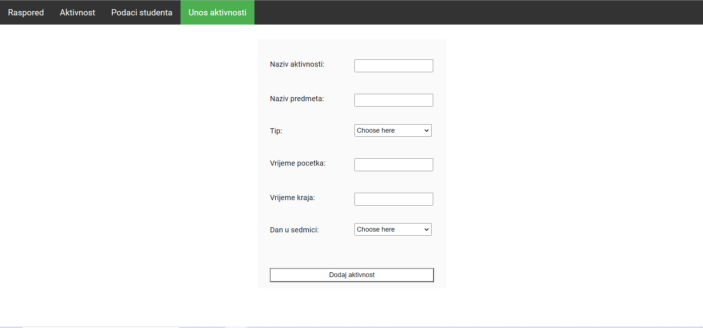

# Time table web application

This is a web application developed for the purpose od learning on Web technologies course. 

### About application

The application has a responsive design:

   
   
   

  

The timetable and its activities can be created by calling JavaScript functions. There are numerous checks that don't allow for more than one activity to be happening at a time. The examples of results of these calls are shown in the picture below:   

 

The activities and subjects can be added using a form shown below. There are separate routes for CRUD operations - the ones that use CSV files and and the ones that use MySQL database. They were implemented using Express.js. 
 
  

There is also a form for adding any number of students at once and putting them into groups. The input field shows the message for the students that cannot be added for any reason.

AJAX was used for all server requests.

Chai & Mocha were used for testing JavaScript functions and backend. Test cases for backend testing are being read from a CSV file.

### Technology stack:
* JavaScript
  * Node.js
    * Express.js
    * Sequelize
    * Chai & Mocha
* HTML & CSS
* MySQL
* AJAX

 
